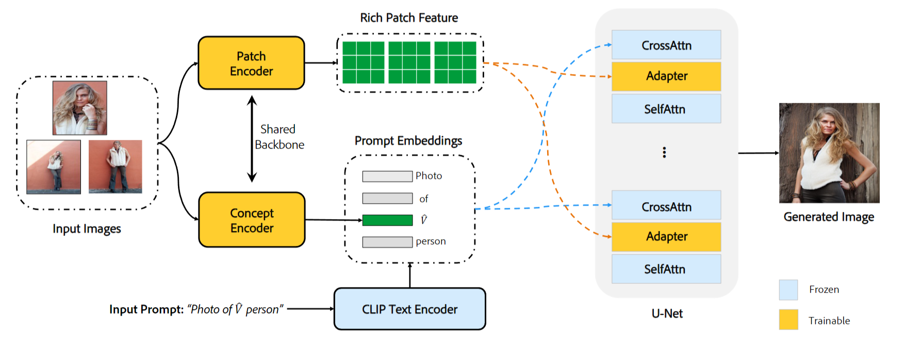

# InstantBooth
My implement of InstantBooth :kissing:

## News
The new project IP-Adapter of Tencent is similar to InstantBooth, if you are interested in it, please see their repository.
https://github.com/tencent-ailab/IP-Adapter

### structure of instant booth

+ **Data Preprocessing**
  + Crop the person and get the mask of foreground.
  + Augmentation during training.
+ **Prompt Creation**
  + Use unique identifier (**automatically** based on the give categories).
+ **Concept Embedding Learning**
  + Image Features (CLIP Image Encoder followed by a randomly initialized fully-connected layer.)
    + $E_{c}$: Concept Encoder 
    + $E_{p}$: Patch Encoder 
  + Text Prompt Embedding Features (CLIP Text Encoder) - Inject to Cross-Attn of Unet.
+ **Rich Representation Learning with Adapters**
+ **Model Training**
  + Dataset Prepare (single person)
    + LIP (Look into Person)
    + ATR (Active Template Regression)
+ **Combined with Controlnet-DensePose**

### Tasks
- [ ] **Data Preprocessing**
- [ ] **Prompt Creation**
- [ ] **Concept Embedding Learning**
- [ ] **Rich Representation Learning with Adapters**
- [ ] **Model Training**
- [ ] **Combined with Controlnet-DensePose**
